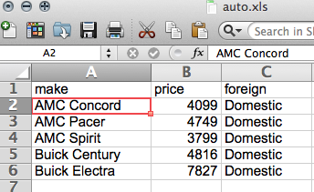
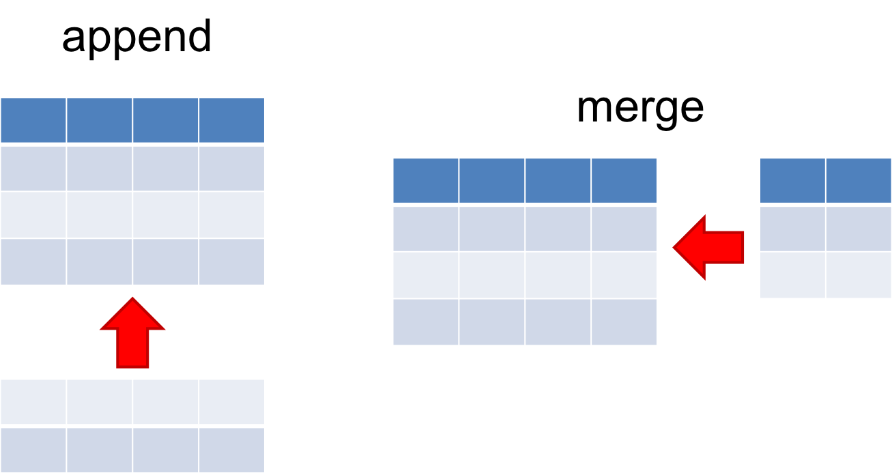
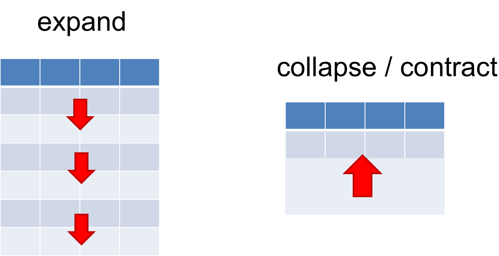
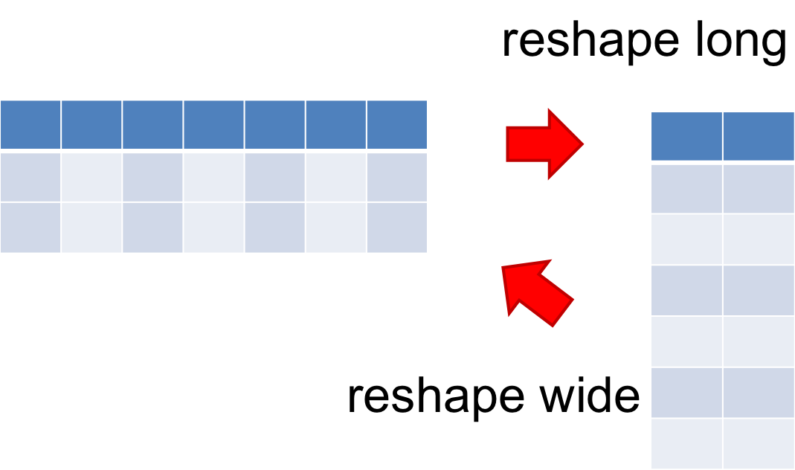
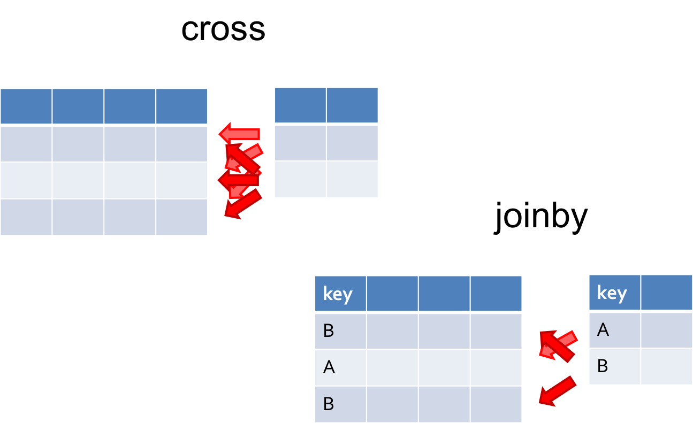
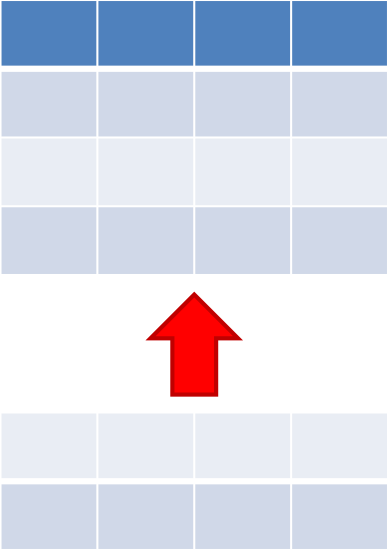
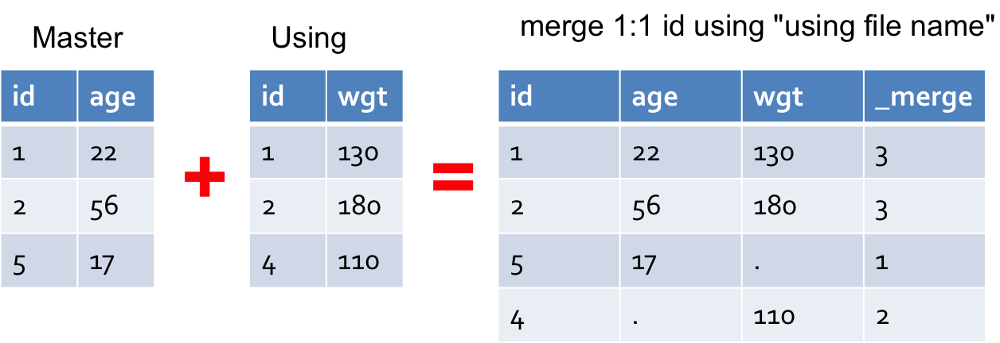

```{r echo=F}
# just enough R to add a primitive stata engine
rm(list=ls())
library(knitr)
setwd('~/Dropbox/Professional/Workshops/Stata/dm')
eng_stata = function(options) {
    fn = tempfile('code', '.')
    do = paste(fn, 'do', sep='.')
    log = paste(fn, 'log', sep='.')
    writeLines(options$code, do)
    cmd = '/Applications/Stata/StataSE.app/Contents/MacOS/StataSE'
    system2(cmd, args=c('-q', '-e', 'do', do))
    out = readLines(log)
    # remove blank lines, dot(.) alone, and "end of do-file"
    out = out[sapply(out, function(line) {
            (nchar(line) > 0) && (line != ". " ) && (line != "end of do-file")
        })]
    on.exit(unlink(c(do, log)))
    knitr:::engine_output(options, options$code, out)
}
knit_engines$set(stata=eng_stata)
opts_chunk$set(engine='stata', cache=F)
```

## Resources

- Prof. Rodríguez http://data.princeton.edu/stata/
- Mitchell(2010) _Data Management Using Stata_<br />
  http://www.stata-press.com/books/data-management-using-stata/
- UCLA ATS http://www.ats.ucla.edu/stat/stata/
- Stata Support Main http://stata.com/support/
- Stata Resources http://stata.com/links
- Stata `help` has links to manual pdf files or using browser:<br />
  http://www.stata-press.com/manuals/documentation-set/
- This presentation and do files are available at github:<br />
  http://github.com/Chang-Y-Chung/dm

## Topics

- Dataset
- Describe / List
- Tabulate / Summarize
- Generate / Replace
- Import from / Export to Excel file
- Append / Merge
- Infile (Free format / Using a dictionary)
- Date / Time *
- By-Group Processing / Egen *

<p style="font-size:60%">Last two are for self-study. Stata do files are provided</p>

## Setup

- example do file (dm.do) and other files are in the zip file attachment
  (dm.zip) sent to you this afternoon
```{r results='hide'}
// cd to where you put this file (dm.do)
cd z:\dm

// check which directory I am in
pwd
```

## Display

```{r results='hide'}
clear all
display 1 + 2

display ln(0.3 / (1 - 0.3))
display logit(0.3)

// it can display strings as well
display "hello, world?"

// some system values
display c(current_date)
```

## Stata Dataset

```{r results='hide'}
// dataset is an array of observations (rows) on variables (columns)
clear all

// describe the current stata dataset in memory ("master" dataset)
describe

// create some observations -- still no variables
set obs 5

// create a variable, x, with all the values equal to 1
generate x = 1

// create another variable, y, with the built-in obs number, _n
generate y = _n

// save the master data into a file on the harddrive
save mydata.dta, replace
```

## Use and List a Dataset
```{r}
use mydata, clear // load the data into main memory
list
```

## Replace

```{r results='hide'}
use mydata, clear

replace x = 2

// replace is often used with either "in" or "if"
replace x = 3 in 1/3
replace y = 9 if y == 5

// you can refer to other variables in the condition as well
replace x = -99 if y < 3

// suppose that -99 in x and 9 in y are missing values
replace x = . if x == -99
replace y = . if y == 9

save mydata2, replace
```

## See mydata2.dta

```{r}
use mydata2, clear
list in 1/5
```

## Random Data

```{r random, results='hide'}
clear all
set obs 50
set seed 12345
generate x = runiform()
generate y = runiform()
twoway scatter x y
graph export random.png, width(400) height(300) replace
```


## Any questions so far?


## Missing Values

```{r}
use mydata2, clear
list
```

## Dichotomizing y around 2.5

```{r results='hide'}
use mydata2, clear

// this may *not* be correct
generate high_y = 0
replace high_y = 1 if 2.5 < y

// correct way
generate high_y2 = 0 if !missing(y)
replace high_y2 = 1 if 2.5 < y & !missing(y)

save mydata3, replace
```

## mydata3.dta

```{r}
use mydata3, clear
list y high_y high_y2
```

## Save

```{r results='hide'}
// create and save
clear all
input id str10 name yob
1 "Amy" 1990
2 "Bill" 1991
3 "Cathy" 1989
end
rename yob year_of_birth
save birth, replace
```

## Use

```{r}
use birth, clear
assert _N == 3
list, abbreviate(15)
```


## Labels

```{r}
use birth.dta, clear
generate gender = 1 if name == "Amy" | name == "Cathy"
replace gender = 2 if name == "Bill"
tabulate gender
save birth2, replace
```

## Labeling Values Takes Two Steps:

```{r results='hide'}
use birth2, clear

// 1. create the value label itself. we use the same name
label define gender 1 "girl" 2 "boy"

// 2. attach the value label to a variable
label values gender gender

save birth3, replace
```

## Check

```{r}
use birth3, clear

tabulate gender
```

## Labeling a Variable

```{r}
use birth3, clear

// labeling a variable is simpler
label var gender "Gender of the respondent"

describe gender
```

## Some Variables from Auto.dta

```{r}
sysuse auto, clear
describe make price mpg foreign
```

## Tabulate | _With_ Value Label

```{r}
sysuse auto, clear
tabulate foreign
```

## Tabulate | _Without_ Value Label

```{r}
sysuse auto, clear
tabulate foreign, nolabel
```

## Summarize

```{r}
sysuse auto, clear
summarize price mpg
```


## Other Useful Commands

```{r results='hide'}
sysuse auto, clear

describe make mpg price
inspect make mpg price
codebook make mpg price
```

## Export to Excel

```{r results='hide'}
sysuse auto, clear
keep make price foreign
keep in 1/5

export excel using auto.xls, replace first(var)
!start auto.xls   // windows
// !open auto.xls    // mac
```



## Import from Excel

```{r}
import excel using auto.xls, clear firstrow
describe
```

## Break for Q & A

## Combining Datasets



## Combining Datasets



## Combining Datasets



## Combining Datasets



## Append Example | Creating odd.dta

```{r}
use http://www.stata-press.com/data/r13/odd1.dta, clear
keep in 1/3
list
save odd.dta, replace
```

## Append Example | Creating even.dta

```{r results='hide'}
clear all
input number even odd
4 10 .
5 12 .
end
list
save even.dta, replace
```

```{r echo=FALSE}
use even.dta, clear
list
```

## Append Example | Put odd and even Together

```{r}
use odd.dta, clear
append using even.dta, generate(obsFrom)
list
```

## Append Pointers



- Syntax: `append using filename [, options]`
- Appends a dataset stored on disk (the _using_ dataset) to the end of the dataset in memory (the _master_ dataset)
- New master dataset will have more observations than before
- Variables are matched by _name_ (not by variable order)
- Non-matched variables on the using side will be included

## Merge Example

```{r results='hide'}
use age, clear // master
merge 1:1 id using weight, report
save ageWeight, replace
```



## How Stata Merges

- Manual says (_Stata Data-Management Reference Manual_ [D] Release 13, p. 465):

<div style="margin: 0 50px 0 50px; font-size:70%">
The formal definition for merge behavior is the following: Start with the first observation of the master. Find the corresponding observation in the using data, if there is one. Record the matched or unmatched result. Proceed to the next observation in the master dataset. When you finish working through the master dataset, work through unused observations from the using data. By default, unmatched observations are kept in the merged data, whether they come from the master dataset or the using dataset.
<br/><br/>
</div>

- See also Bill Gould's two-part blog entry on "Merging data" at:
    + Part 1: Merges gone bad [http://tinyurl.com/jvtloka](http://blog.stata.com/2011/04/18/merging-data-part-1-merges-gone-bad/)
    + Part 2: Multiple-key merges [http://tinyurl.com/krhs7xn](http://blog.stata.com/2011/05/27/merging-data-part-2-multiple-key-merges/)

## One-to-One Match Merge Pointers


- Syntax: `merge 1:1 varlist using filename`
- Joins corresponding observations from master and using datasets, matching on the key variable(s).
- Master data are _inviolable_, i.e., if there already exists a variable in master, the values are not replaced.
- By default, merge creates a new variable, `_merge`, which indicates:
    + `1` (master) this obs from master dataset only
    + `2` (using) this obs from using dataset only
    + `3` (match) this obs from both master and using datasets

## Break Time

- Any questions, so far?

## Inputting Raw Data

- Stata stores data in a proprietary format, i.e., the `.dta` file
- Once data are stored in a `.dta` file, we can quicky load the data into memory by the `use` command
- If data are given in other formats, we have to input / read / import them into stata first
- One common such format is known as a raw data file, which stata assumes to have a file extension of `.raw`

## `infile` Example


```{r}
infile str14 country setting effort change using test.raw, clear
list in 1/3
```

_Free format_ raw data

- values are delimited by a space, tab, or comma
- string value is quoted if embeds spaces or commas
- if one observation per line, then consider using `insheet` instead

## Fixed Column Format

- `test.raw` can also be read as a fixed column format, since the values of each variable appear in the fixed columns, for example:
    + country names are always in columns 4 to 17
    + settings values are always in columns 23 and 24
    
- This information can be stored in a separate _dictionary file_:


- `test.dct`

<br /><br /><br /><br />

- Using the dictionary file, the data can be read into stata like so:
```{r, results='hide'}
infile using test.dct, clear
```

## Import / Export Pointers

- Stat/Transfer can import / export data to and from various formats

- But don't blindly trust any piece of software that _translates_ data from one system / package / application to another

- Be careful and double-check everything

- Ask help

## Thanks a lot!

- Any questions?
